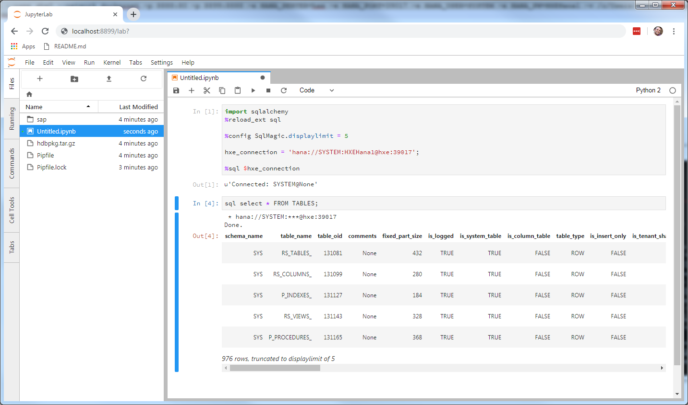
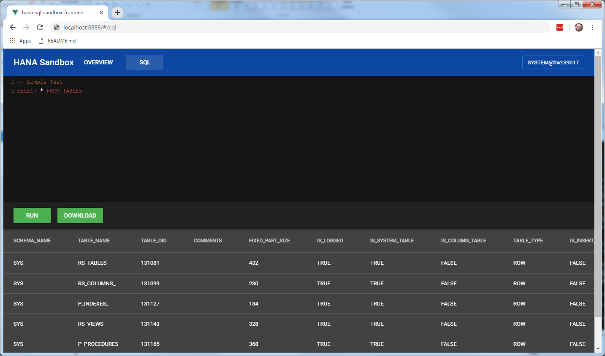

[](https://github.com/entmike/hana-sql-sandbox-docker/issues)
[](https://hub.docker.com/r/entmike/hana-sql-sandbox/)
[](https://hub.docker.com/r/entmike/hana-sql-sandbox/)

# Summary
This Docker Image can be used to run a container that will:

1) Connect to a HANA DB and let you run simple SQL Statements to a HANA DB.
2) Run a Jupyter Notebook where you can run Python commands against a HANA DB.

It is based on a Ubuntu image, and runs 2 modules that you can read more about here:

## Main Modules
1) https://github.com/entmike/hana-sql-sandbox-backend

2) https://github.com/entmike/hana-sql-sandbox-frontend

3) Jupyter Notebook pre-configured, based mostly on steps described by [@adadouche](https://github.com/adadouche) on https://developers.sap.com/tutorials/mlb-hxe-tools-jupyter.html.

# Screenshots


*Example Jupyter Notebook working with HANA Express Docker Container*



*Example Vue Frontend working with HANA Express Docker Container*

# Usage Examples

## Running with a Jupyter Notebook
From a Terminal/Command Prompt/PowerShell/ssh session run:
```
docker run -t --rm \
-p 8888:80 \
-p 8899:8888 \
-v /optionalpath/topersist/yournotebooks:/home/jupyteradm/notebooks
-e HANA_SERVER=myhanabox.example.com \
-e HANA_PORT=39017 \
-e HANA_USER=SYSTEM \
-e HANA_PW=MySecretPassword \
entmike/hana-sql-sandbox:latest
```
*In this example, port 8888 maps to the simple Vue App containing some HANA utilities.  Port 8899 maps to the Jupyter Notebook configured with the HANA DB Client Libraries (assuming you followed the Pre-requisite steps to provide the HANA DB Client Software)*

# Usage (without Jupyter Notebook)
From a Terminal/Command Prompt/PowerShell/ssh session run:
```
docker run -t --rm \
-p 8888:80 \
-e HANA_SERVER=myhanabox.example.com \
-e HANA_PORT=39017 \
-e HANA_USER=SYSTEM \
-e HANA_PW=MySecretPassword \
entmike/hana-sql-sandbox:latest
```
To end, press Control-C in your Terminal/Command Prompt/PowerShell/ssh session.

# Usage Example when connecting to HANA Express running in its own Docker Container (with Jupyter Notebook)
```
docker run -t --rm --network SharedDockerNetwork \
-p 8888:80 \
-p 8899:8888 \
-e HANA_SERVER=hxe \
-e HANA_PORT=39017 \
-e HANA_USER=SYSTEM \
-e HANA_PW=MySecretPassword \
entmike/hana-sql-sandbox:latest
```
*In this example, both this container and the HANA Express Container are expected to be running in Docker network `SharedDockerNetwork`.  The `HANA_SERVER` parameter will be the Container Name of your HANA Express Container.*
